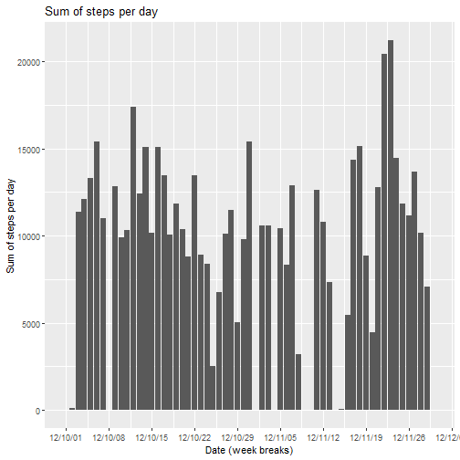
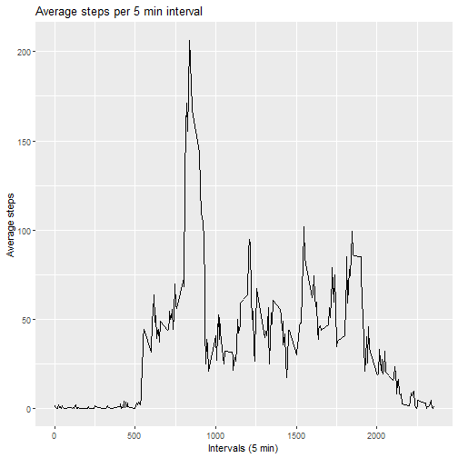
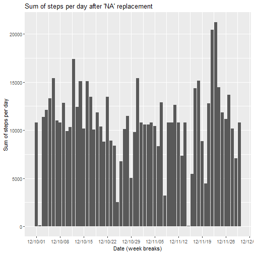
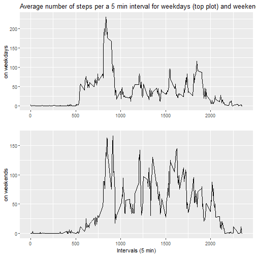

<br/><br/>
This is the Reproducible Research Course Project #1.

The goal of the project is to learn how to effectively create a document with the RStudio embedded tools
which can be published as html page and utilized by other researches in order to reproduce the data analysis.

As an example of the data analysis, simple manipulation over the data set comprising observations and values of activity monitoring will be used. More detailed information as to the data set and the assignment in whole can be reached here: 
<https://github.com/dmalygin/RepData_PeerAssessment1/blob/master/README.md>

<br/><br/>
According to the assignment the following steps need to be described here:


***
#### 1. Loading and preprocessing the data

```r
#####################################################
# Obtain name of the file (.zip archive with dataset)
#####################################################

urlLinkToDataSet <- "https://d396qusza40orc.cloudfront.net/repdata%2Fdata%2Factivity.zip"

library(dplyr)
fileName <- URLdecode(urlLinkToDataSet) %>% basename()


###########################
# Download the .zip archive
###########################

if (!file.exists(fileName)) {
  download.file(urlLinkToDataSet, fileName, method = "curl")
  print ("File was downloaded successfully")
} else {
  cat("The file [", fileName, "] already exists!")
}


################
# Unzip the file
################

library(tools)
dirName <- file_path_sans_ext(fileName)

if (!file.exists(dirName)) { 
  dir.create(dirName)
  unzip(fileName, exdir = dirName)
  print ("File was unzipped successfully")
}


###################################
# Read the data set into data frame
###################################

filePath <- list.files(dirName, full.names = TRUE)

activityDataFrame <- read.csv(filePath, header = TRUE)
```

<br></br>
Take a glance at the uploaded data frame:

```r
head(activityDataFrame)
```

```
##   steps       date interval
## 1    NA 2012-10-01        0
## 2    NA 2012-10-01        5
## 3    NA 2012-10-01       10
## 4    NA 2012-10-01       15
## 5    NA 2012-10-01       20
## 6    NA 2012-10-01       25
```

***

#### 2. What is mean total number of steps taken per day?

On this step according to the assignment we will ignore the missing values in the dataset.

Calculate the total number of steps per day:

```r
sumOfStepsPerDay <- aggregate(list(Sum_of_steps = activityDataFrame$steps), list(Date = activityDataFrame$date), sum, na.rm = TRUE)

sumOfStepsPerDay$Date <- as.Date(sumOfStepsPerDay$Date)
```


<br></br>

+ Create histogram with the total number of steps per day:

```r
library(ggplot2)
library(scales)
ggplot(sumOfStepsPerDay, aes(x=Date, y=Sum_of_steps)) +
  geom_bar(stat="identity") +
  scale_x_date(date_breaks = "1 week", labels = date_format("%y/%m/%d")) +
  ggtitle("Sum of steps per day") +
  xlab("Date (week breaks)") + 
  ylab("Sum of steps per day")
```



+ Calculate the mean of the total number of steps taken per day:

```r
mean(sumOfStepsPerDay$Sum_of_steps)
```

```
## [1] 9354.23
```


+ Calculate the median of the total number of steps taken per day:

```r
median(sumOfStepsPerDay$Sum_of_steps)
```

```
## [1] 10395
```


***

#### 3. What is the average daily activity pattern?

+ Make a time series plot (i.e. type="l") of the 5-minute interval (x-axis) and the average number of steps taken, averaged across all days (y-axis)


Calculate average steps for interval №0, 5, 10, etc.:

```r
avgStepsPerInterval <- aggregate(list(Avg_steps = activityDataFrame$steps), list(Interval = activityDataFrame$interval), mean, na.rm = TRUE)
```

Create a plot:

```r
library(ggplot2)
library(scales)
ggplot(avgStepsPerInterval, aes(x = Interval, y=Avg_steps)) +
  geom_line() +
  ggtitle("Average steps per 5 min interval") +
  xlab("Intervals (5 min)") +
  ylab("Average steps")
```



+ Which 5-minute interval, on average across all the days in the dataset, contains the maximum number of steps?


```r
rowNmber <- which.max(avgStepsPerInterval$Avg_steps)
avgStepsPerInterval[rowNmber,]
```

```
##     Interval Avg_steps
## 104      835  206.1698
```

As we can see the interval №104 contains the maximum average number of steps across all days


***

#### 4. Imputing missing values

+ Calculate and report the total number of missing values in the dataset (i.e. the total number of rows with NAs):


```r
numberOfMissingValues <- sum(is.na(activityDataFrame$steps))
```

+ Devise a strategy for filling in all of the missing values in the dataset. The strategy does not need to be sophisticated. For example, you could use the mean/median for that day, or the mean for that 5-minute interval, etc.

In this step we will use 'the mean for the 5-minute interval across all days' to fill in empty steps.
Such strategy is convenient for 2 reasons:
1. Average number of steps for particular interval across all days is more representable then average steps for the particular day.
2. We have already calculated average number of steps for every interval


Let's take a glance at our previous calculations:

```r
head(avgStepsPerInterval)
```

```
##   Interval Avg_steps
## 1        0 1.7169811
## 2        5 0.3396226
## 3       10 0.1320755
## 4       15 0.1509434
## 5       20 0.0754717
## 6       25 2.0943396
```


To fill in NA steps we will find number of intervals with NA value of steps and replace it with the appropriate value of steps from the data frame we just took a glance at.


```r
filledActivityDataFrame <- activityDataFrame

len <- length(filledActivityDataFrame$interval)

for(i in 1:len){
  if(is.na(filledActivityDataFrame$steps[i])) {
    searchedInterval <- filledActivityDataFrame[i, ]$interval
    filledActivityDataFrame[i, ]$steps <- avgStepsPerInterval[which(avgStepsPerInterval$Interval == searchedInterval), ]$Avg_steps
  }
}
```

Check that replacement was performed:

```r
head(filledActivityDataFrame)
```

```
##       steps       date interval
## 1 1.7169811 2012-10-01        0
## 2 0.3396226 2012-10-01        5
## 3 0.1320755 2012-10-01       10
## 4 0.1509434 2012-10-01       15
## 5 0.0754717 2012-10-01       20
## 6 2.0943396 2012-10-01       25
```

+ Make a histogram of the total number of steps taken each day and Calculate and report the mean and median total number of steps taken per day. Do these values differ from the estimates from the first part of the assignment? What is the impact of imputing missing data on the estimates of the total daily number of steps?

Calculate the total number of steps per day:

```r
sumOfStepsPerDayAfterReplacement <- aggregate(list(Sum_of_steps = filledActivityDataFrame$steps), list(Date = filledActivityDataFrame$date), sum, na.rm = TRUE)

sumOfStepsPerDayAfterReplacement$Date <- as.Date(sumOfStepsPerDayAfterReplacement$Date)
```


+ Create histogram with the total number of steps per day:

```r
library(ggplot2)
library(scales)
ggplot(sumOfStepsPerDayAfterReplacement, aes(x=Date, y=Sum_of_steps)) +
  geom_bar(stat="identity") +
  scale_x_date(date_breaks = "1 week", labels = date_format("%y/%m/%d")) +
  ggtitle("Sum of steps per day after 'NA' replacement") +
  xlab("Date (week breaks)") + 
  ylab("Sum of steps per day")
```




+ Calculate the mean of the total number of steps taken per day:

```r
mean(sumOfStepsPerDayAfterReplacement$Sum_of_steps)
```

```
## [1] 10766.19
```


+ Calculate the median of the total number of steps taken per day:

```r
median(sumOfStepsPerDayAfterReplacement$Sum_of_steps)
```

```
## [1] 10766.19
```

Do these values differ from the estimates from the first part of the assignment?

Yes, they changed.

Mean from the first part of the assignment is: 9354.23
Mean from the second part of the assignment is: 10395

Meidan from the first part of the assignment is: 10766.19
Median from the second part of the assignment is: 10766.19


What is the impact of imputing missing data on the estimates of the total daily number of steps?
Since 'NA' values were replaced with average number of steps for the appropriate intervals, total daily number of steps was increased which led to increase of mean and median.


***

#### 5. Are there differences in activity patterns between weekdays and weekends?

For this part we will use the dataset with the filled-in missing values.

+ Create a new factor variable in the dataset with two levels – “weekday” and “weekend” indicating whether a given date is a weekday or weekend day.

```r
filledActivityDataFrame$date <- as.Date(filledActivityDataFrame$date)

weekdaysVector <- c('Monday', 'Tuesday', 'Wednesday', 'Thursday', 'Friday')

filledActivityDataFrame$week_day <- factor((weekdays(filledActivityDataFrame$date) %in% weekdaysVector), levels=c(FALSE, TRUE), labels = c('weekend', 'weekday'))
```


+ Make a panel plot containing a time series plot (i.e. type = "l" of the 5-minute interval (x-axis) and the average number of steps taken, averaged across all weekday days or weekend days (y-axis). See the README file in the GitHub repository to see an example of what this plot should look like using simulated data.


Subset weekdays/weekends data from the dataframe:

```r
weekdaysActivityDataFrame <- subset(filledActivityDataFrame, week_day == "weekday")
weekendsActivityDataFrame <- subset(filledActivityDataFrame, week_day == "weekend")
```


Calculate average number of steps for every interval across all weekdays:

```r
weekdaysAvgStepsPerInterval <- aggregate(list(Avg_steps = weekdaysActivityDataFrame$steps), list(Interval = weekdaysActivityDataFrame$interval), mean)

weekendsAvgStepsPerInterval <- aggregate(list(Avg_steps = weekendsActivityDataFrame$steps), list(Interval = weekendsActivityDataFrame$interval), mean)
```


Build a plot of average number of steps per interval across all weekdays:

```r
library(ggplot2)
library(scales)
plotWeekdays <- ggplot(weekdaysAvgStepsPerInterval, aes(x = Interval, y=Avg_steps)) +
  geom_line() +
  ggtitle("Average number of steps per a 5 min interval for weekdays (top plot) and weekends (lower plot)") +
  xlab("") +
  ylab("on weekdays")
```


Build a plot of  average number of steps per interval across all weekdays:

```r
plotWeekends <- ggplot(weekendsAvgStepsPerInterval, aes(x = Interval, y=Avg_steps)) +
  geom_line() +
  xlab("Intervals (5 min)") +
  ylab("on weekends")
```


Combine the plots together:

```r
# uncomment if you need to install the package
#install.packages("cowplot")
library(cowplot)

plot_grid(plotWeekdays,
          plotWeekends,
          label_x = 0.2,
          ncol = 1)
```




